# Human ↔ Robot Transfer Lab

人类视频标注与跨本体转换的研究代码、启动工具和实际样例。

**本页 48 个动画示例**：24 个人类标注、8 个人手→机械臂、4 个人体→机器人、12 个机器人→人手版本（后者来自 6 段源视频）。[完整效果主页：66 个结果 / 53 段源片段](https://robot-human-video-lab.panmiao307.chatgpt.site/)。

预览截取前 3 秒、5 FPS；**点击动画查看完整展示视频**。标注与机器人转人均采用两列，横向三栏对照独占一行。所有画面来自实际实验，包含漏检和失败。模型标注不等于人工真值，转换结果尚未验证接触或动作等价。

## 首次安装（只做一次）

建议 Linux、Python 3.11/3.12。标注使用 CPU；两类几何替换另需机器人资产；VACE 生成需要 NVIDIA CUDA GPU 和独立环境。

```bash
# Ubuntu / Debian：已有这些系统依赖可跳过
sudo apt-get update
sudo apt-get install -y git ffmpeg python3-venv libgl1 libglib2.0-0

git clone https://github.com/pm1255/human-robot-transfer.git
cd human-robot-transfer
bash scripts/setup.sh cpu
source .venv/bin/activate
mkdir -p inputs outputs
```

macOS 的系统依赖可用 `brew install ffmpeg`；MediaPipe 在部分无图形上下文环境初始化失败时，使用 Linux。安装脚本创建 `.venv`、安装 Python 依赖并下载 Hand Landmarker、Pose Landmarker Full、EfficientDet Lite0 三个官方模型到 `models/mediapipe/`。已有模型时可以用 `--models /path/to/models`。

将自己的视频放到 `inputs/`。下面命令均在仓库根目录执行；每次使用新的 `--out`，防止旧标注或生成缓存被误用。[完整准备说明与故障排查](docs/QUICKSTART.md)

## 1. 人类视频标注 · 24 例

双手关键点、人体关键点、物体框与缺失记录。第一人称视频中不把拍摄者全身猜测作为有效全身标注；第三人称模型结果仍需审核。示例按覆盖率抽样，包含漏检。

<table>
<tr>
<td align="center" width="50%"><a href="https://robot-human-video-lab.panmiao307.chatgpt.site/showcase/epic_003408.mp4">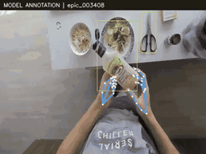</a><br><sub>epic_003408</sub></td>
<td align="center" width="50%"><a href="https://robot-human-video-lab.panmiao307.chatgpt.site/showcase/epic_002681.mp4">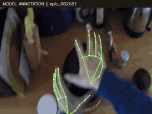</a><br><sub>epic_002681</sub></td>
</tr>
<tr>
<td align="center" width="50%"><a href="https://robot-human-video-lab.panmiao307.chatgpt.site/showcase/epic_003706.mp4">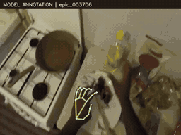</a><br><sub>epic_003706</sub></td>
<td align="center" width="50%"><a href="https://robot-human-video-lab.panmiao307.chatgpt.site/showcase/epic_003867.mp4">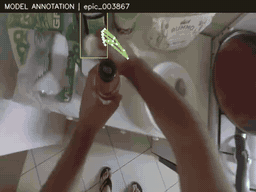</a><br><sub>epic_003867</sub></td>
</tr>
<tr>
<td align="center" width="50%"><a href="https://robot-human-video-lab.panmiao307.chatgpt.site/showcase/epic_001301.mp4">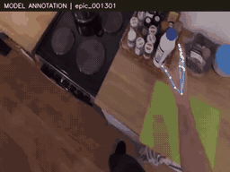</a><br><sub>epic_001301</sub></td>
<td align="center" width="50%"><a href="https://robot-human-video-lab.panmiao307.chatgpt.site/showcase/epic_000260.mp4">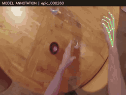</a><br><sub>epic_000260</sub></td>
</tr>
<tr>
<td align="center" width="50%"><a href="https://robot-human-video-lab.panmiao307.chatgpt.site/showcase/epic_000718.mp4">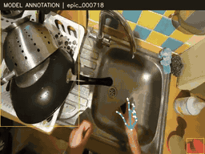</a><br><sub>epic_000718</sub></td>
<td align="center" width="50%"><a href="https://robot-human-video-lab.panmiao307.chatgpt.site/showcase/epic_001542.mp4">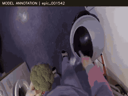</a><br><sub>epic_001542</sub></td>
</tr>
<tr>
<td align="center" width="50%"><a href="https://robot-human-video-lab.panmiao307.chatgpt.site/showcase/epic_000577.mp4">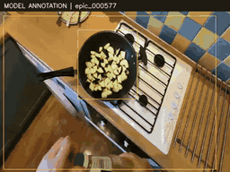</a><br><sub>epic_000577</sub></td>
<td align="center" width="50%"><a href="https://robot-human-video-lab.panmiao307.chatgpt.site/showcase/epic_002011.mp4">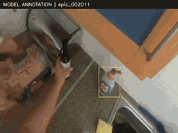</a><br><sub>epic_002011</sub></td>
</tr>
<tr>
<td align="center" width="50%"><a href="https://robot-human-video-lab.panmiao307.chatgpt.site/showcase/epic_003905.mp4">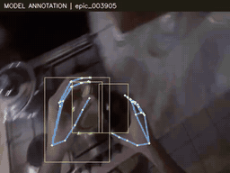</a><br><sub>epic_003905</sub></td>
<td align="center" width="50%"><a href="https://robot-human-video-lab.panmiao307.chatgpt.site/showcase/epic_001880.mp4">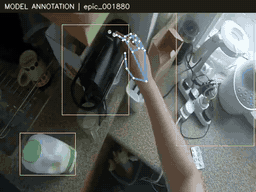</a><br><sub>epic_001880</sub></td>
</tr>
<tr>
<td align="center" width="50%"><a href="https://robot-human-video-lab.panmiao307.chatgpt.site/showcase/epic_000039.mp4">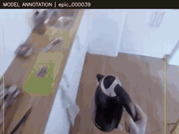</a><br><sub>epic_000039</sub></td>
<td align="center" width="50%"><a href="https://robot-human-video-lab.panmiao307.chatgpt.site/showcase/epic_001805.mp4">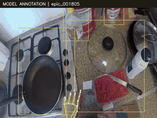</a><br><sub>epic_001805</sub></td>
</tr>
<tr>
<td align="center" width="50%"><a href="https://robot-human-video-lab.panmiao307.chatgpt.site/showcase/epic_003179.mp4">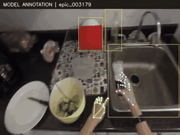</a><br><sub>epic_003179</sub></td>
<td align="center" width="50%"><a href="https://robot-human-video-lab.panmiao307.chatgpt.site/showcase/epic_001856.mp4"></a><br><sub>epic_001856</sub></td>
</tr>
<tr>
<td align="center" width="50%"><a href="https://robot-human-video-lab.panmiao307.chatgpt.site/showcase/hmdb_body_swing_baseball_00.mp4">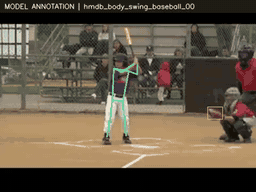</a><br><sub>hmdb_body_swing_baseball_00</sub></td>
<td align="center" width="50%"><a href="https://robot-human-video-lab.panmiao307.chatgpt.site/showcase/hmdb_body_cartwheel_03.mp4">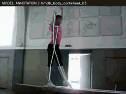</a><br><sub>hmdb_body_cartwheel_03</sub></td>
</tr>
<tr>
<td align="center" width="50%"><a href="https://robot-human-video-lab.panmiao307.chatgpt.site/showcase/hmdb_body_golf_01.mp4">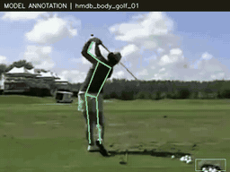</a><br><sub>hmdb_body_golf_01</sub></td>
<td align="center" width="50%"><a href="https://robot-human-video-lab.panmiao307.chatgpt.site/showcase/hmdb_wave_01.mp4">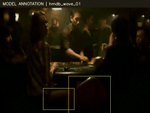</a><br><sub>hmdb_wave_01</sub></td>
</tr>
<tr>
<td align="center" width="50%"><a href="https://robot-human-video-lab.panmiao307.chatgpt.site/showcase/hmdb_stand_02.mp4">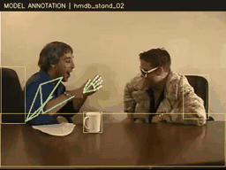</a><br><sub>hmdb_stand_02</sub></td>
<td align="center" width="50%"><a href="https://robot-human-video-lab.panmiao307.chatgpt.site/showcase/hmdb_pick_02.mp4">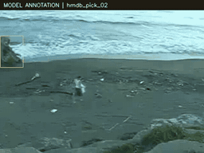</a><br><sub>hmdb_pick_02</sub></td>
</tr>
<tr>
<td align="center" width="50%"><a href="https://robot-human-video-lab.panmiao307.chatgpt.site/showcase/hmdb_body_swing_baseball_02.mp4">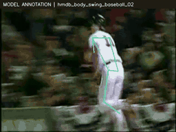</a><br><sub>hmdb_body_swing_baseball_02</sub></td>
<td align="center" width="50%"><a href="https://robot-human-video-lab.panmiao307.chatgpt.site/showcase/hmdb_body_cartwheel_01.mp4">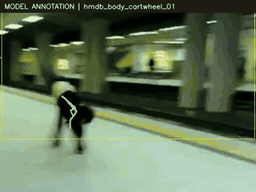</a><br><sub>hmdb_body_cartwheel_01</sub></td>
</tr>
</table>

### 一键启动：标注自己的视频

```bash
python tools/run.py annotate --video inputs/human.mp4 --view egocentric --out outputs/annotation
# 第三人称 / 全身视频：将 --view 改为 exocentric
```

输出：`outputs/annotation/annotated.mp4`、`annotations/clip/annotation.json`、`summary.json`、`supervision.npz`。默认处理前 6 秒，`--seconds 12` 可扩到 12 秒；这是短片预览入口。

## 2. 人手 → Aloha 机械臂 · 8 例

每行依次为 **原视频 / 删除掩码 / 机器人渲染**。当前是几何合成预览，背景修补、相机尺度、遮挡与接触仍不可靠。

<p align="center"><a href="https://robot-human-video-lab.panmiao307.chatgpt.site/showcase/convert_epic_000004.mp4">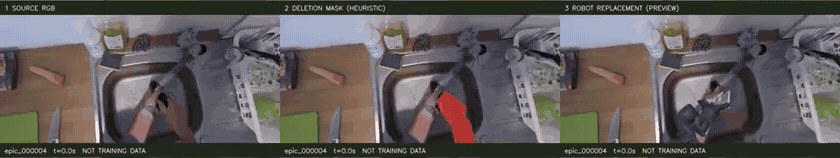</a><br><sub>epic_000004</sub></p>

<p align="center"><a href="https://robot-human-video-lab.panmiao307.chatgpt.site/showcase/convert_epic_000007.mp4">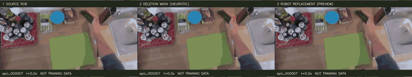</a><br><sub>epic_000007</sub></p>

<p align="center"><a href="https://robot-human-video-lab.panmiao307.chatgpt.site/showcase/convert_epic_000015.mp4">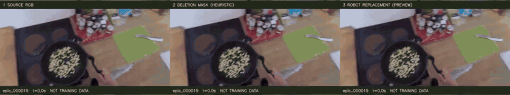</a><br><sub>epic_000015</sub></p>

<p align="center"><a href="https://robot-human-video-lab.panmiao307.chatgpt.site/showcase/convert_epic_000040.mp4">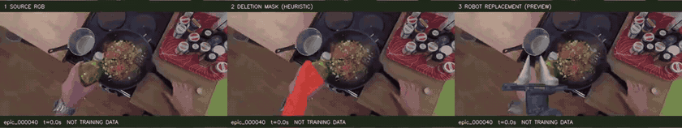</a><br><sub>epic_000040</sub></p>

<p align="center"><a href="https://robot-human-video-lab.panmiao307.chatgpt.site/showcase/convert_epic_000100.mp4">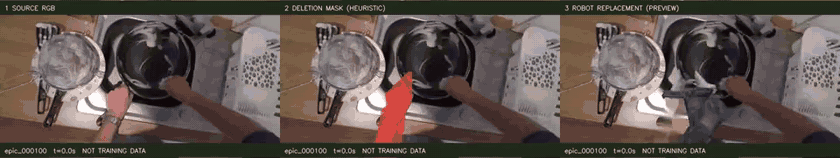</a><br><sub>epic_000100</sub></p>

<p align="center"><a href="https://robot-human-video-lab.panmiao307.chatgpt.site/showcase/convert_epic_000250.mp4">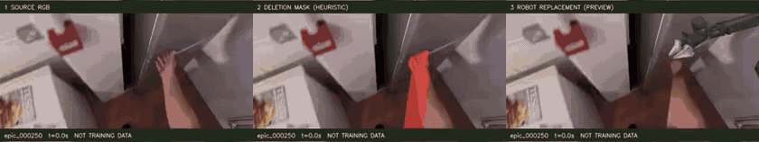</a><br><sub>epic_000250</sub></p>

<p align="center"><a href="https://robot-human-video-lab.panmiao307.chatgpt.site/showcase/convert_epic_000500.mp4">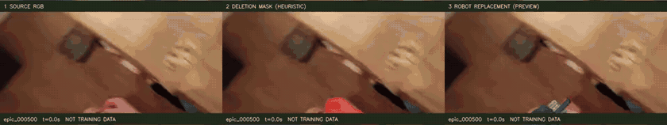</a><br><sub>epic_000500</sub></p>

<p align="center"><a href="https://robot-human-video-lab.panmiao307.chatgpt.site/showcase/convert_epic_001000.mp4">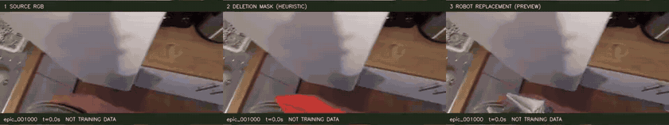</a><br><sub>epic_001000</sub></p>

### 初次准备 + 一键启动：人手转机械臂

```bash
# 安装几何渲染依赖；首次运行一次即可
bash scripts/setup.sh render
source .venv/bin/activate

# 下载并解压 RoboTwin 官方机器人资产包（首次运行）
python -m pip install huggingface_hub
mkdir -p third_party/robotwin-assets
python -c "from huggingface_hub import hf_hub_download; hf_hub_download(repo_id='TianxingChen/RoboTwin2.0', repo_type='dataset', filename='embodiments.zip', local_dir='third_party/robotwin-assets')"
python -m zipfile -e third_party/robotwin-assets/embodiments.zip third_party/robotwin-assets

python tools/run.py arm --video inputs/human.mp4 \
  --aloha-assets third_party/robotwin-assets/embodiments/aloha-agilex --out outputs/arm
```

[机器人资产获取与目录结构](docs/QUICKSTART.md#aloha-资产)。启动入口串联手部标注、轨迹处理、Aloha IK、网格导出和三栏渲染。输出：`outputs/arm/conversion/clip.mp4` 与逐帧审计 `clip.json`。不会把预览自动标为可训练机器人动作。

## 3. 人体 → G1 全身机器人 · 4 例

同样采用全宽三栏：**原视频 / 人体删除掩码 / G1 替换**。全身姿态拟合不代表机器人平衡、接触或运动可执行。

<p align="center"><a href="https://robot-human-video-lab.panmiao307.chatgpt.site/showcase/convert_hmdb_body_golf_03.mp4">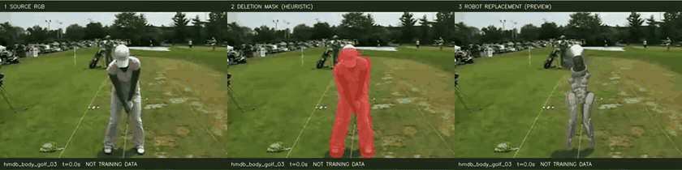</a><br><sub>hmdb_body_golf_03</sub></p>

<p align="center"><a href="https://robot-human-video-lab.panmiao307.chatgpt.site/showcase/convert_hmdb_body_golf_02.mp4">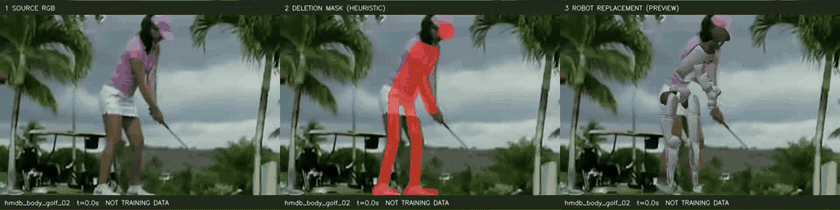</a><br><sub>hmdb_body_golf_02</sub></p>

<p align="center"><a href="https://robot-human-video-lab.panmiao307.chatgpt.site/showcase/convert_hmdb_body_kick_ball_00.mp4">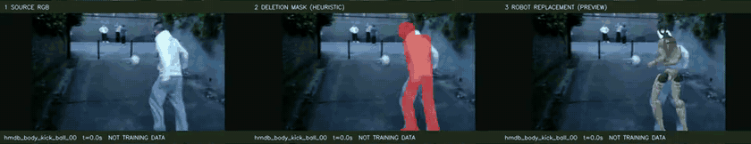</a><br><sub>hmdb_body_kick_ball_00</sub></p>

<p align="center"><a href="https://robot-human-video-lab.panmiao307.chatgpt.site/showcase/convert_hmdb_body_cartwheel_00.mp4">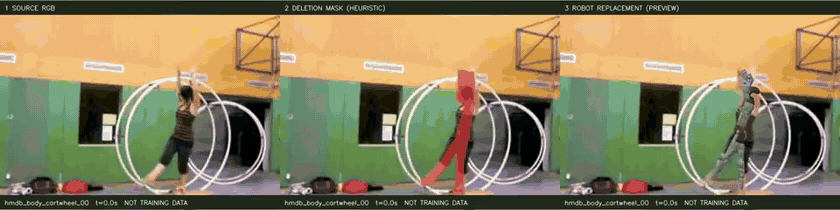</a><br><sub>hmdb_body_cartwheel_00</sub></p>

### 初次准备 + 一键启动：人体转机器人

```bash
bash scripts/setup.sh render
source .venv/bin/activate
mkdir -p third_party
git clone --depth 1 https://github.com/unitreerobotics/unitree_mujoco.git third_party/unitree_mujoco
python tools/run.py humanoid --video inputs/full_body.mp4 \
  --g1-xml third_party/unitree_mujoco/unitree_robots/g1/g1_29dof.xml \
  --out outputs/humanoid
```

使用 G1 的 **29 DOF** XML 及相邻网格，不能替换为 23 DOF 模型。输出：`outputs/humanoid/annotated.mp4`、`conversion/clip.mp4` 和逐帧拟合记录。

## 4. 机器人 → 人手 · 12 个版本 / 6 个场景

每行并排展示同一场景的 A/B 候选。扩大编辑区域后的结果仍可能出现手指融合、腕部翻转、夹爪残留及物体变形，尚不构成可靠的强配对动作数据。

<table>
<tr>
<td align="center" width="50%"><a href="https://robot-human-video-lab.panmiao307.chatgpt.site/assets/bridge_bridge_007089/handroom/seed2026/human.mp4">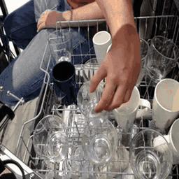</a><br><sub>取出玻璃杯 · 扩大掩码 A</sub></td>
<td align="center" width="50%"><a href="https://robot-human-video-lab.panmiao307.chatgpt.site/assets/bridge_bridge_007089/handroom/seed2027/human.mp4">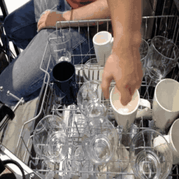</a><br><sub>取出玻璃杯 · 扩大掩码 B</sub></td>
</tr>
<tr>
<td align="center" width="50%"><a href="https://robot-human-video-lab.panmiao307.chatgpt.site/assets/bridge_bridge_015993/handroom/seed2026/human.mp4">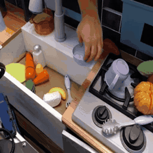</a><br><sub>抬起蓝色碗 · 扩大掩码 A</sub></td>
<td align="center" width="50%"><a href="https://robot-human-video-lab.panmiao307.chatgpt.site/assets/bridge_bridge_015993/handroom/seed2027/human.mp4">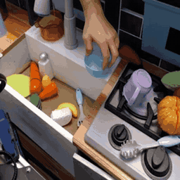</a><br><sub>抬起蓝色碗 · 扩大掩码 B</sub></td>
</tr>
<tr>
<td align="center" width="50%"><a href="https://robot-human-video-lab.panmiao307.chatgpt.site/assets/bridge_bridge_040489/handroom/seed2026/human.mp4">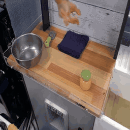</a><br><sub>金属盆放到紫毛巾 · 扩大掩码 A</sub></td>
<td align="center" width="50%"><a href="https://robot-human-video-lab.panmiao307.chatgpt.site/assets/bridge_bridge_040489/handroom/seed2027/human.mp4">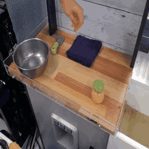</a><br><sub>金属盆放到紫毛巾 · 扩大掩码 B</sub></td>
</tr>
<tr>
<td align="center" width="50%"><a href="https://robot-human-video-lab.panmiao307.chatgpt.site/assets/bridge_bridge_041207/handroom/seed2026/human.mp4">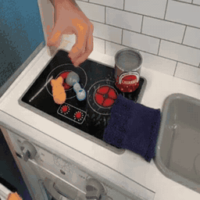</a><br><sub>移动红色罐子 · 扩大掩码 A</sub></td>
<td align="center" width="50%"><a href="https://robot-human-video-lab.panmiao307.chatgpt.site/assets/bridge_bridge_041207/handroom/seed2027/human.mp4">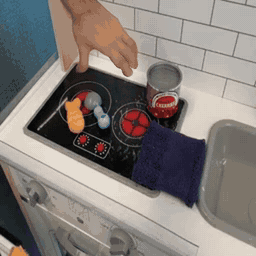</a><br><sub>移动红色罐子 · 扩大掩码 B</sub></td>
</tr>
<tr>
<td align="center" width="50%"><a href="https://robot-human-video-lab.panmiao307.chatgpt.site/assets/bridge_bridge_042977/handroom/seed2026/human.mp4">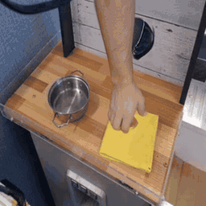</a><br><sub>移动金属锅 · 扩大掩码 A</sub></td>
<td align="center" width="50%"><a href="https://robot-human-video-lab.panmiao307.chatgpt.site/assets/bridge_bridge_042977/handroom/seed2027/human.mp4">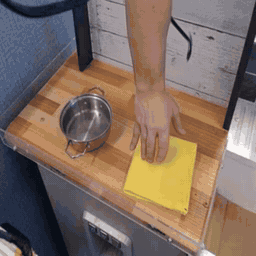</a><br><sub>移动金属锅 · 扩大掩码 B</sub></td>
</tr>
<tr>
<td align="center" width="50%"><a href="https://robot-human-video-lab.panmiao307.chatgpt.site/assets/bridge_bridge_045160/handroom/seed2026/human.mp4">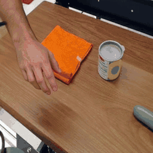</a><br><sub>抓取与移动罐子 · 扩大掩码 A</sub></td>
<td align="center" width="50%"><a href="https://robot-human-video-lab.panmiao307.chatgpt.site/assets/bridge_bridge_045160/handroom/seed2027/human.mp4">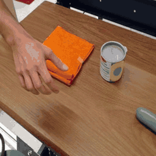</a><br><sub>抓取与移动罐子 · 扩大掩码 B</sub></td>
</tr>
</table>

### 初次准备 + 一键启动：机器人转人手

先按 [GPU 环境与权重准备](docs/QUICKSTART.md#vace-环境) 建立 `.venv-vace` 并下载 VACE 1.3B。输入需要同一时间轴的机器人视频、黑白编辑掩码视频，以及一张目标人手参考图；白色区域允许生成、黑色区域保留。参考图和掩码必须由使用者准备，不能仅凭机器人视频自动保证正确抓握。

```bash
bash scripts/setup_vace.sh  # 首次安装依赖并下载权重
source .venv-vace/bin/activate
python tools/run.py robot2human --video inputs/robot.mp4 \
  --mask inputs/robot_mask.mp4 --reference inputs/human_reference.png \
  --prompt "A human hand grasps the cup and lifts it with a stable wrist." \
  --wan third_party/Wan2.1 --weights models/Wan2.1-VACE-1.3B \
  --out outputs/robot2human
```

输出：`outputs/robot2human/results/1.3B_baseline/custom/seed2026/` 中的 `human.mp4`、`raw_generated.mp4`、`source_aligned.mp4`、`mask_overlay.mp4` 和生成记录。可加 `--variant handroom` 扩大掩码，但物体边缘也可能被修改。默认前 6 秒、源采样 5 FPS、512²、40 步；新入口不依赖原服务器 v4 清单。

## 代码与验证范围

| 目录 | 内容 |
|---|---|
| `tools/run.py`、`scripts/setup.sh` | 新增通用启动与环境准备入口 |
| `human2robot/h2r/`、`human2robot/v2/` | 标注、轨迹、几何重定向与渲染 |
| `human2robot/v3/`、`human2robot/v4/` | 历史视频/动作训练；v4 不是双向视频编辑器 |
| `robot2human/` | VACE 视频编辑与配对导出 |
| `runtime_snapshots/` | 原服务器运行源码，保留历史路径用于溯源 |
| `website/`、`human2robot/web/` | 效果展示页和标注查看器 |

[验证记录](VALIDATION.md) · [源码哈希](SOURCE_MANIFEST.json) · [项目状态](PROJECT_STATUS.md)。本次补齐使用入口与可视化，不宣称转换质量得到提升，也不启动训练。

## 许可与来源

原创代码采用 [MIT](LICENSE)。媒体、第三方机器人资产和模型不在 MIT 授权内。EPIC-KITCHENS 示例遵循 [CC BY-NC 4.0](https://creativecommons.org/licenses/by-nc/4.0/)，BridgeData V2 示例遵循 [CC BY 4.0](https://creativecommons.org/licenses/by/4.0/)，HMDB51 片段的权利归原权利人；这些是非商业研究展示的派生预览。

来源：[EPIC-KITCHENS · Damen 等](https://epic-kitchens.github.io/2026)、[HMDB51 · Kuehne 等 / Serre Lab](https://serre.lab.brown.edu/)、[BridgeData V2 · Walke 等](https://rail-berkeley.github.io/bridgedata/)。已做截取、缩放、标注叠加、几何或 AI 编辑，不代表数据集作者背书。[逐例来源与哈希](docs/gallery/provenance.json)。
