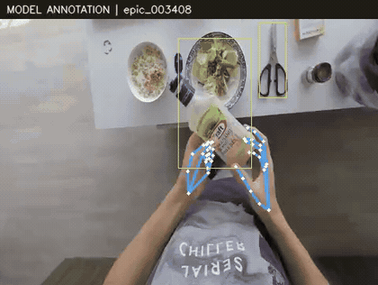
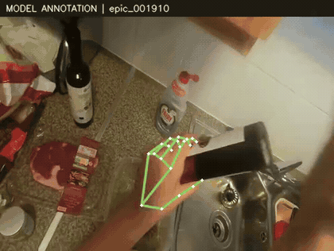
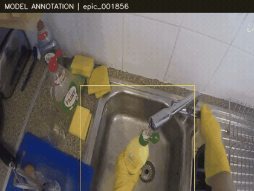
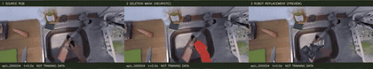
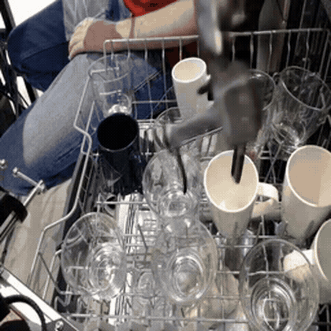

# Human ↔ Robot Transfer Lab

**人类视频标注与跨本体转换的研究记录 · 本轮项目已结束（2026-09-24）**

我们保留双手、人体和物体的模型标注、轨迹处理与审计工具，作为本项目最值得复用的部分。人→机械臂、人→全身机器人和机器人→人手的转换结果目前均不够可靠，相关代码与失败样例一并开放，供复现和分析。

[完整可视化主页：66 个结果 / 53 段源片段](https://robot-human-video-lab.panmiao307.chatgpt.site/) · [项目结论](PROJECT_STATUS.md) · [安装与代码入口](#安装与代码入口)

## 人类视频标注示例

下面是实际处理过的视频片段，关键点与框来自模型预测，**不是人工真值**。左右手身份、遮挡和接触仍需审核；检出率不能当作准确率。

| 双手关键点 | 手与物体交互 |
|---|---|
|  |  |
| EPIC `003408`：保留两只手的独立关键点。 | EPIC `001910`：检查抓握过程中关键点的连续性。 |

**也保留漏检。** 下例整段视频的手部检出率约为 5%；预览只展示开头 4 秒，缺失关键点没有被补造成检测结果。



标注工具支持双手跟踪、全身可见性门控、物体框、时间戳、来源记录和缺失审计。第一人称视频中，拍摄者的全身不可见时，不把模型猜测的身体当作可靠全身标注。

## 跨本体转换：保留失败，不作为成熟能力

| 人手 → 机械臂：几何合成预览 | 机器人 → 人手：生成失败 |
|---|---|
|  |  |
| 原视频 / 删除掩码 / 机器人网格渲染。逐帧补背景、尺度和遮挡仍有问题。 | VACE 14B 的玻璃杯样例：仍出现机械夹爪，增加模型参数量未解决替换问题。 |

全身机器人替换、其余失败案例和原始/生成视频的同步逐帧对照见[完整主页](https://robot-human-video-lab.panmiao307.chatgpt.site/)。机器人→人手只有 **6 个独立场景、18 个推理版本**；不同随机种子不计为新场景。

这些结果没有证明接触正确、动作等价或下游策略收益，不建议直接作为强配对动作监督。`v4` 是动作与未来视频预测训练代码，**不是可直接双向运行的视频编辑器**。

## 为什么更关注隐式人类视频学习

当前观察支持把后续研究重点放在人类视频中的时序、交互与表征学习，减少对失真外观转换和未验证伪动作的依赖。可比较机器人数据基线、隐式人类视频辅助、显式关键点辅助及标签置乱对照，并在匹配数据曝光量的条件下评估下游表现。

**这是一条研究方向，不是本仓库已经证明的优势。** 人类视频预训练仍面临视角、本体和任务差异；已有代码与小规模实验不能证明普遍有效或可替代真实机器人数据。本轮开源以现状收尾，不再追加转换模型或训练实验。

## 安装与代码入口

```bash
git clone https://github.com/pm1255/human-robot-transfer.git
cd human-robot-transfer/human2robot
python -m venv .venv
source .venv/bin/activate
pip install -e '.[test,vision]'
python -m pytest -q
```

| 路径 | 内容 |
|---|---|
| `human2robot/h2r/` | 手部标注、轨迹修复、URDF/FK/IK、参考导出 |
| `human2robot/v2/annotate.py` | 双手、全身与物体模型标注 |
| `human2robot/v2/render_conversion.py` | Aloha / G1 几何合成预览 |
| `human2robot/v3/`、`human2robot/v4/` | 视频、语言、动作训练与评估实验 |
| `robot2human/` | SAM2 + Wan VACE 编辑及配对导出 |
| `human2robot/web/`、`website/` | 标注查看器与公开展示页源码 |
| `runtime_snapshots/` | 与整理后主源码分开保留的服务器运行版本 |

渲染、训练与导出依赖分别见 `.[render]`、`.[train]`、`.[export]`。Wan/SAM2 代码、模型权重和机器人网格需单独准备。训练和集群脚本保留历史实验路径，运行前需按自己的环境配置，不能直接视为零配置复现包。详细说明见 [Human2Robot](human2robot/README.md)、[Robot2Human](robot2human/README.md)。

33 项现有 Human2Robot 测试通过；不代表生成质量或真机有效性验证。[验证范围](VALIDATION.md) · [源码哈希](SOURCE_MANIFEST.json) · [历史优化分析](OPTIMIZATION.md)

## 许可与来源

本仓库原创代码以 [MIT License](LICENSE) 开放。**预览媒体、原始数据、第三方代码及模型不在这项授权内**，分别遵守原许可证。

README 的人类视频及机械臂替换预览派生自 [EPIC-KITCHENS，Damen 等](https://epic-kitchens.github.io/2026)，遵循 [CC BY-NC 4.0](https://creativecommons.org/licenses/by-nc/4.0/)；机器人转人预览派生自 [BridgeData V2，Walke 等](https://rail-berkeley.github.io/bridgedata/)，遵循 [CC BY 4.0](https://creativecommons.org/licenses/by/4.0/)。预览经过裁剪、缩放、模型标注或 AI/几何编辑，数据集作者未提供或背书这些派生效果。[媒体来源记录](docs/assets/provenance.json)

外部依赖包括 [Wan2.1](https://github.com/Wan-Video/Wan2.1)、[VACE](https://github.com/ali-vilab/VACE)、[SAM2](https://github.com/facebookresearch/sam2)、MediaPipe、MuJoCo 与 RoboTwin。原始视频、模型权重、完整数据集和认证信息未随仓库发布。
